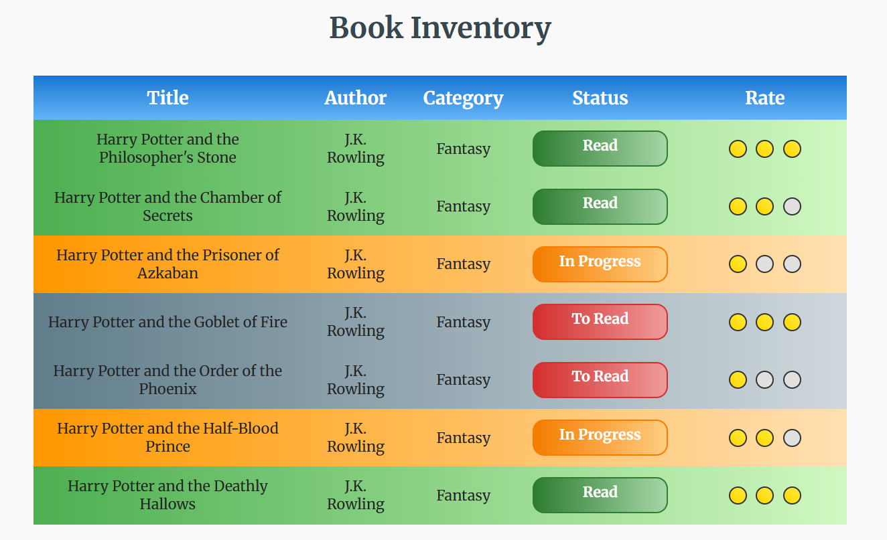

# 📚 Book Inventory  

> 📘 **This project is one of the required projects for the _Responsive Web Design Certification_ from freeCodeCamp.**

A clean and organized **Book Inventory** webpage built using **HTML** and **CSS**, featuring gradient-based status badges, a CSS-only star rating system, and a table showcasing all seven *Harry Potter* books.

This project demonstrates semantic HTML, advanced CSS selectors, responsive design techniques, and elegant UI styling.

---



---

## 🌟 Features

- 🎨 **Modern UI** using CSS gradients and custom variables  
- 🔖 **Book statuses:** Read, In Progress, To Read  
- ⭐ **CSS-only 1–3 star rating system**  
- 🔤 **Elegant typography** via Google Fonts  
- 📐 **Responsive table layout**  
- 🎯 **Advanced CSS selectors**, including:  
  - Attribute selectors  
  - Substring selectors  
  - Descendant selectors  
  - `linear-gradient()` backgrounds  

---

🚀 How to Run:
  1. Clone the repository:  
     ```bash
     git clone https://github.com/your-username/book-inventory-app-css-freecodecamp.git
     ```
  2. Navigate to the project folder:  
     ```bash
     cd book-inventory-app-css-freecodecamp
     ```
  3. Open `index.html` in your browser
- 👩‍💻 Author: **Nataliia Gvozdovska – Web Developer & Designer**
- Created on: November 20, 2025
